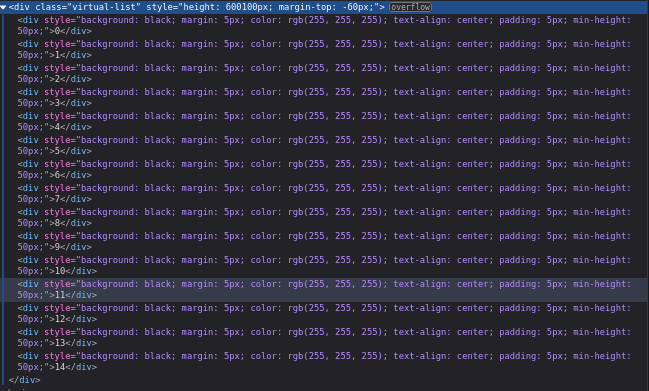

# Build virtual list

## Running a project

```bash
# install dependencies
npm install
```

## Developing

Once you've installed dependencies with `npm install` (or `pnpm install` or `yarn`), start a development server:

```bash
npm run dev

# or start the server and open the app in a new browser tab
npm run dev -- --open
```

## Result


